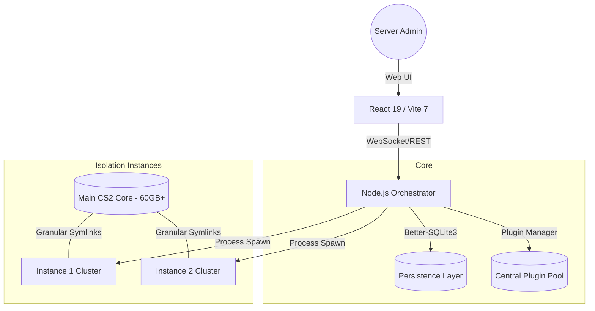

<<<<<<< HEAD
#  Quatrix CS2 Server Manager
=======
#  Quatrix CS2 Server Manager
>>>>>>> 6aa83d6561dbcad76f95f52dc42f42149d2a83fb

[](https://opensource.org/licenses/MIT)
[](https://nodejs.org/)
[](https://react.dev/)
[](https://www.typescriptlang.org/)
[](https://vitejs.dev/)


**Quatrix** is an elite, real-time web orchestration platform designed for professional Counter-Strike 2 server clusters. It bridges the gap between raw CLI power and premium UI aesthetics, offering a "glassmorphism" inspired dashboard with zero-latency feedback.

---

## � The Quatrix Difference

Unlike traditional panels, Quatrix is built on three core technical pillars that ensure stability and performance for competitive environments:

### 1. The Isolation Performance Engine

Quatrix uses a proprietary **Granular Symlinking Strategy**. While other panels either copy everything (wasting space) or symlink everything (breaking plugins), Quatrix:

- Physically **copies** engine binaries (`cs2`, `gameinfo.gi`) to force instance root recognition.
- **Symlinks** 99% of bulk game data (.vpk files) to save hundreds of gigabytes.
- Keeps `addons` and `cfg` folders local to prevent cross-instance configuration leakage.

### 2. Plugin Priority Orchestration

Total control over the Source2 search path sequence. Quatrix automatically patches `gameinfo.gi` to ensure **Metamod** and **CounterStrikeSharp** load with absolute priority before any core game libraries, eliminating common "Unknown command" or "API Failed" errors.

### 3. Smart Asset Sync

Real-time map and workshop synchronization. Quatrix automatically discovers workshop map filenames and generates themed UI visuals, ensuring your dashboard always matches your server's current state.

---

## 🚀 Key Features

| Feature                 | Description                                                                      | Status |
| :---------------------- | :------------------------------------------------------------------------------- | :----- |
| **Elite Dashboard**     | Real-time telemetry (CPU/RAM/Net) with millisecond-accurate delta monitoring.    | ✅     |
| **Advanced RCON**       | High-speed console with ANSI color support and intelligent auto-scroll.          | ✅     |
| **Player Intelligence** | Live list with Steam avatars, latency tracking, and moderated session data.      | ✅     |
| **Plugin Pool**         | "Pool Strategy" distribution - sync any plugin (AFKManager, CSS, etc) instantly. | ✅     |
| **Config Editor**       | Integrated modal to edit plugin `.json`, `.cfg`, `.toml`, `.txt` configs live.   | ✅     |
| **Admin Manager**       | Native CounterStrikeSharp integration for real-time permission management.       | ✅     |
| **Web Explorer**        | Integrated file manager for real-time config editing without SFTP.               | ✅     |
| **Self-Healing**        | Auto-detects and repairs invalid file structures before server boot.             | ✅     |

---

## 🏗️ Technical Architecture



---

## ⚙️ Engineering Specs

- **Frontend**: React 19 (Suspense Enabled), Vite 7, Tailwind CSS (Custom Design System).
- **Backend**: Node.js 20+ (LTS), Express 5 (Alpha Features), Socket.IO 4.8.
- **Database**: Better-SQLite3 (Synchronous/High-Performance IO).
- **Automation**: SteamCMD Integration, Automated systemd Service Provisioning, Unified Linux Installer.

---

## 🏃 Quick Start (Linux)

The fastest way to deploy Quatrix on a fresh Ubuntu/Debian VDS:

### ⚡ One-Liner Installation

```bash
curl -sSL https://raw.githubusercontent.com/cspamsky/quatrix/main/install.sh | sudo bash
```

This command automatically:

1. Installs all dependencies (Node.js 20, .NET 8, 32-bit libs).
2. Creates a dedicated `quatrix` user for security.
3. Clones the project into `/home/quatrix/quatrix`.
4. Configures a `systemd` service with `KillMode=process` (Zero-downtime restarts).
5. Optimizes the `UFW` firewall for CS2 traffic.

### 🛠️ Service Management

```bash
sudo systemctl start quatrix     # Start the engine
sudo systemctl status quatrix    # Check health
sudo journalctl -u quatrix -f    # Live orchestration logs
```

---

## 🗺️ Roadmap

- [x] **Core Isolation Engine**: Stable granular symlinking and instance roots.
- [x] **Smart Admin UI**: Real-time CounterStrikeSharp permission management.
- [x] **Metric Telemetry**: High-fidelity resource monitoring.
- [ ] **Infrastructure Backups**: Automated snapshots of plugin configs and DB states.
- [ ] **External DB Cluster**: Integrated MariaDB support for global ranks.
- [ ] **Global API**: RCON pooling for 3rd party integrations.

---

## 🤝 Contribution & Support

Quatrix is built with precision for professional server owners. ⚡
Developed by **cspamsky**.

_License: [MIT](LICENSE)_
